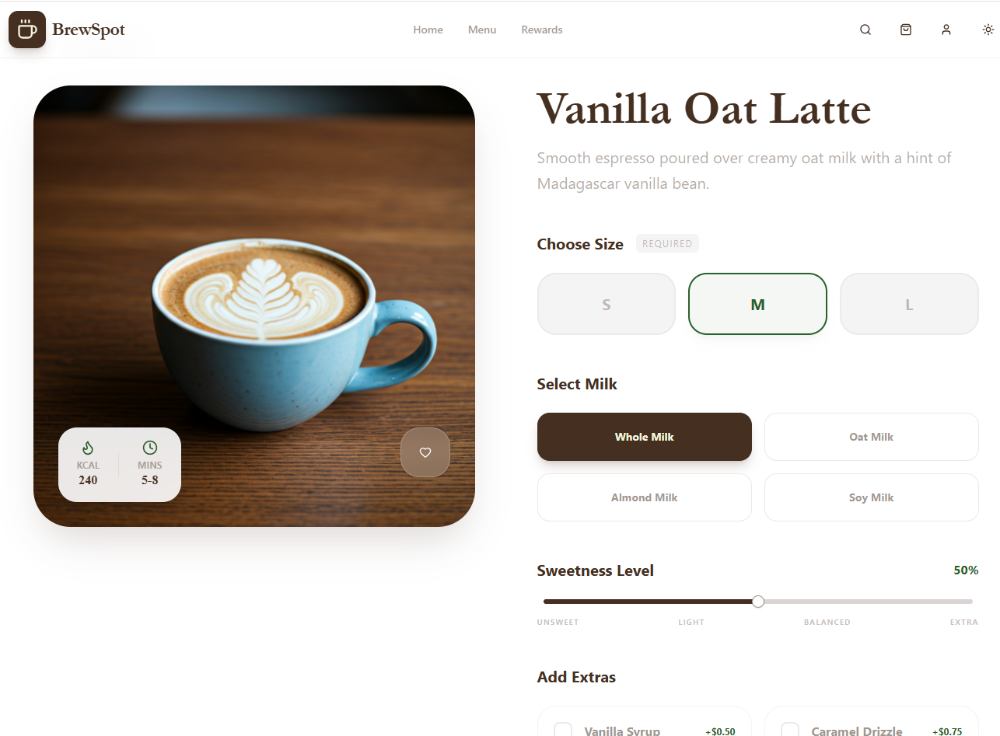

<div align="center">
  <br />
  <a href="https://github.com/pro-grammer-SD/brewspot">
    
  </a>
  <h1 align="center">BrewSpot ☕ | Coffee Ordering Platform (Template) 🌟</h1>

  <p align="center">
    <strong>Experience Coffee in God-Mode</strong>
    <br />
    An artisanal, production-grade ordering application built for the modern web.
    <br />
    <br />
    <a href="https://github.com/pro-grammer-SD/brewspot/issues">Report Bug</a>
    ·
    <a href="https://github.com/pro-grammer-SD/brewspot/pulls">Request Feature</a>
  </p>
</div>
</div>

<br />

<div align="center">
  
</div>

<br />

## ⚡ Introduction

**BrewSpot** is a premium coffee ordering platform redesigned from the ground up to demonstrate **"God-Mode" UI/UX**. It combines liquid glass aesthetics (`backdrop-blur`), deep luxury dark modes, and fluid interactions into a cohesive, high-performance product.

Built with the bleeding-edge **React 19** and **Tailwind CSS v4**, customized with **EB Garamond** typography for that authentic artisanal feel.

## 🛠️ Tech Stack

<div align="center">


</div>

## ✨ Key Features

### 🎨 "God-Mode" UI & Aesthetics
-   **Liquid Glass Design**: Extensive use of frosted glass effects (`.glass`, `.glass-panel`) for a modern, airy feel.
-   **Deep Luxury Dark Mode**: A sophisticated dark theme featuring a sharp `#0a0a0a` background with `#D4A373` (Golden Bronze) accents.
-   **Artisanal Typography**: Headlines powered by **EB Garamond**, UI by **Inter**, and data by **JetBrains Mono**.
-   **Fluid Animations**: Page transitions, hover effects, and micro-interactions powered by **Framer Motion**.

### 🛍️ Unified Ordering Experience
-   **Dynamic Menu**: Real-time filtering (Hot, Iced, Seasonal) and instant search with auto-focus.
-   **Deep Customization**: Adjust size, milk, sweetness, and add-ons with dynamic pricing.
-   **Smart Cart**: Persistent state management ensures your cart is always ready.

### 🏆 Gamified Rewards
-   **Visual Dashboard**: Track progress towards your next Gold Tier reward.
-   **Celebratory Moments**: Canvas confetti explosions when claiming rewards.
-   **Account Hub**: Manage settings and view order history in a glassmorphism dashboard.

## 🚀 Getting Started

### Prerequisites

*   **Node.js** (v18 or higher)
*   **npm** or **yarn**

### Installation

1.  **Clone the repository**
    ```bash
    git clone https://github.com/pro-grammer-SD/brewspot.git
    cd brewspot
    ```

2.  **Install dependencies**
    ```bash
    npm install
    ```

3.  **Start the development server**
    ```bash
    npm run dev
    ```

4.  **Build for production**
    ```bash
    npm run build
    ```

## 📂 Project Structure

```bash
src/
├── components/          # 🧩 Reusable UI blocks
│   ├── coffee/          # Domain components (CoffeeCard, Cart)
│   ├── layout/          # Global layout (Navbar, Transitions)
│   └── ui/              # Shadcn primitives (Buttons, Inputs)
├── routes/              # ⚡ Page views (Home, Menu, Checkout)
├── store/               # 🧠 Global state (Zustand)
├── lib/                 # 🛠️ Utilities
├── index.css            # 🎨 Theme & Tailwind config
└── App.tsx              # 🛣️ Routing logic
```

## 🎨 Design System

The app uses a highly customized Tailwind setup. Adjustments can be made in `src/index.css`.

| Variable | Description |
| :--- | :--- |
| `.glass` | Subtle frosted glass effect |
| `.glass-panel` | Heavy frosted glass for panels |
| `--primary` | Golden Bronze (Brand Color) |
| `--background` | `#0a0a0a` (Dark Mode) |

## 🤝 Contributing

Contributions are what make the open source community such an amazing place to learn, inspire, and create. Any contributions you make are **greatly appreciated**.

1.  Fork the Project
2.  Create your Feature Branch (`git checkout -b feature/AmazingFeature`)
3.  Commit your Changes (`git commit -m 'Add some AmazingFeature'`)
4.  Push to the Branch (`git push origin feature/AmazingFeature`)
5.  Open a Pull Request

## 📄 License

Distributed under the MIT License. See `LICENSE` for more information.

---

<div align="center">
  <p>Developed with ❤️ and ☕ by <a href="https://github.com/pro-grammer-SD">pro-grammer-SD</a></p>
</div>
